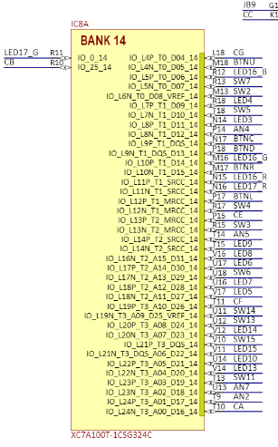
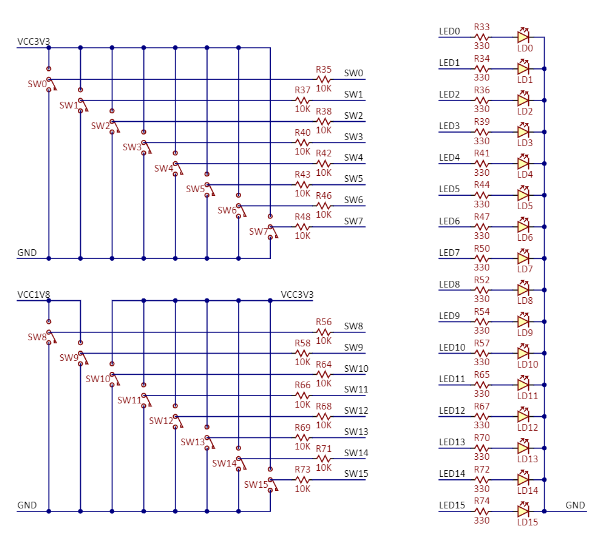
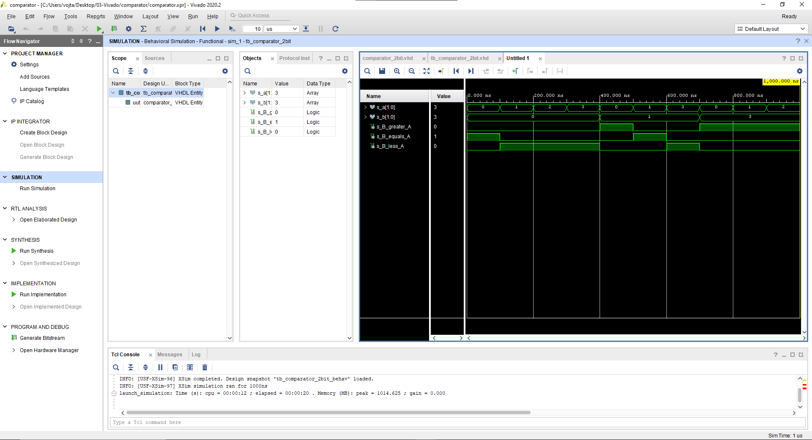
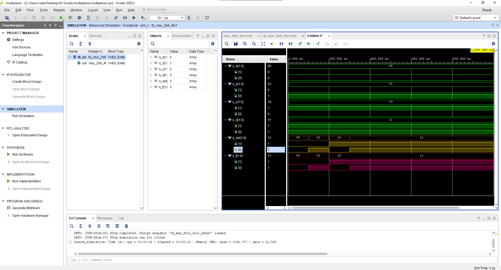

# Preparation tasks
```
Výstupy pro ledky:
```

```
zapojení ledek a přepínačů:
```

# Part 2: Project creation in Vivado

# Multiplexer
## Tabulka pro a=00 b=01 c=10 d=11
| **Select sel_i[1:0]** | **Output f_o[1:0]** |
| :-: | :-: |
| 0 0 | 0 0 |
| 0 1 | 0 1|
| 1 0 | 1 0 |
| 1 1 | 1 1 |


## Architektura
```VHDL
------------------------------------------------------------------------
library ieee;
use ieee.std_logic_1164.all;

entity mux_2bit_4to1 is
    port(
        a_i           : in  std_logic_vector(2 - 1 downto 0);
        b_i           : in  std_logic_vector(2 - 1 downto 0);
        c_i           : in  std_logic_vector(2 - 1 downto 0);
        d_i           : in  std_logic_vector(2 - 1 downto 0);
        sel_i         : in  std_logic_vector(2 - 1 downto 0);

        f_o    : out std_logic_vector(2 - 1 downto 0)
    );
end entity mux_2bit_4to1;

architecture Behavioral of mux_2bit_4to1 is
begin
    f_o <= a_i when (sel_i = "00" ) else
           b_i when (sel_i = "01" ) else
           c_i when (sel_i = "10" ) else
           d_i when (sel_i = "11" );
    

end architecture Behavioral;

```
## Testbench
```VHDL
library ieee;
use ieee.std_logic_1164.all;

entity tb_mux_2bit_4to1 is
end entity tb_mux_2bit_4to1;
architecture testbench of tb_mux_2bit_4to1 is

    signal s_a       : std_logic_vector(2 - 1 downto 0);
    signal s_b       : std_logic_vector(2 - 1 downto 0);
    signal s_c       : std_logic_vector(2 - 1 downto 0);
    signal s_d       : std_logic_vector(2 - 1 downto 0);
    signal s_sel     : std_logic_vector(2 - 1 downto 0);
    
    signal s_f     : std_logic_vector(2 - 1 downto 0);

begin
    uut_mux_2bit_4to1 : entity work.mux_2bit_4to1
        port map(
            a_i           => s_a,
            b_i           => s_b,
            c_i           => s_c,
            d_i           => s_d,
            sel_i         => s_sel,
            f_o           => s_f

        );

    p_stimulus : process
    begin
        report "Stimulus process started" severity note;

        s_a <= "00"; s_b <= "01"; s_c <= "10"; s_d <= "11";
        s_sel <= "00"; wait for 100 ns;
        s_sel <= "01"; wait for 100 ns;
        s_sel <= "10"; wait for 100 ns;
        s_sel <= "11"; wait for 100 ns;
        
        report "Stimulus process finished" severity note;
        wait;
    
    
    end process p_stimulus;

end architecture testbench;

```
## Screen

# Vivado návod
## Vytváření projektu
```
1)není vhodné volit název projektu nebo cestu s diakritikou nebo mezerami
2)RTL project
3)Přídání zdrojů přez create file v kroku add sources a nastavení VHDL kodu(dá se udělat i potom)
4)Add constrains není zatim nutné
5)Jako desku jsem zvolil Nexys A7-50T
```
## Add sources
```
1)File
2)Add Sources
3)Add or create simulation sources
4)create a new VHDL
```
## Simulace
```
1)Flow
2)Run Simulation
3)Run Behavioral Simulation
4)run Vivado simulator.
5)Potom je dobré po zobrazení simulace kliknout na tlačitko fit které mi roztahne simulaci hezky na cele okno
```
