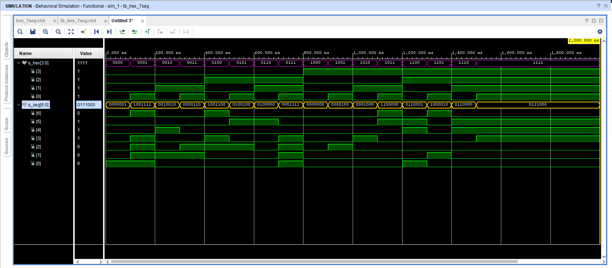

## Schema

## Tabulka

| **Hex** | **Inputs** | **A** | **B** | **C** | **D** | **E** | **F** | **G** |
| :-: | :-: | :-: | :-: | :-: | :-: | :-: | :-: | :-: |
| 0 | 0000 | 0 | 0 | 0 | 0 | 0 | 0 | 1 |
| 1 | 0001 | 1 | 0 | 0 | 1 | 1 | 1 | 1 |
| 2 | 0010 | 0 | 0 | 1 | 0 | 0 | 1 | 0 |
| 3 | 0011 | 0 | 0 | 0 | 0 | 1 | 1 | 0 |
| 4 | 0100 | 1 | 0 | 0 | 1 | 1 | 0 | 0 |
| 5 | 0101 | 0 | 1 | 0 | 0 | 1 | 0 | 0 |
| 6 | 0110 | 0 | 1 | 0 | 0 | 0 | 0 | 0 |
| 7 | 0111 | 0 | 0 | 0 | 1 | 1 | 1 | 1 |
| 8 | 1000 | 0 | 0 | 0 | 0 | 0 | 0 | 0 |
| 9 | 1001 | 0 | 0 | 0 | 0 | 1 | 0 | 0 |
| A | 1010 | 0 | 0 | 0 | 1 | 0 | 0 | 0 |
| b | 1011 | 1 | 1 | 0 | 0 | 0 | 0 | 0 |
| C | 1100 | 0 | 1 | 1 | 0 | 0 | 0 | 1 |
| d | 1101 | 1 | 0 | 0 | 0 | 0 | 1 | 0 |
| E | 1110 | 0 | 1 | 1 | 0 | 0 | 0 | 0 |
| F | 1111 | 0 | 1 | 1 | 1 | 0 | 0 | 0 |

# Seven-segment display decoder. Submit:
## Architektura
```VHDL
library ieee;
use ieee.std_logic_1164.all;

entity hex_7seg is
    port(
        hex_i           : in  std_logic_vector(4 - 1 downto 0);

        seg_o           : out std_logic_vector(7 - 1 downto 0)
    );
end entity hex_7seg;

architecture behavioral of hex_7seg is
begin

    p_7seg_decoder : process(hex_i)
    begin
        case hex_i is
            when "0000" =>
                seg_o <= "0000001";     -- 0
            when "0001" =>
                seg_o <= "1001111";     -- 1
            when "0010" =>
                seg_o <= "0010010";     -- 2
            when "0011" =>
                seg_o <= "0000110";     -- 3
            when "0100" =>
                seg_o <= "1001100";     -- 4
            when "0101" =>
                seg_o <= "0100100";     -- 5
            when "0110" =>
                seg_o <= "0100000";     -- 6
            when "0111" =>
                seg_o <= "0001111";     -- 7
            when "1000" =>
                seg_o <= "0000000";     -- 8
            when "1001" =>
                seg_o <= "0000100";     -- 9
            when "1010" =>
                seg_o <= "0001000";     -- A            
            when "1011" =>
                seg_o <= "1100000";     -- b
            when "1100" =>
                seg_o <= "0110001";     -- C
            when "1101" =>
                seg_o <= "1000010";     -- d    
            when "1110" =>
                seg_o <= "0110000";     -- E
            when others =>
                seg_o <= "0111000";     -- F
        end case;
    end process p_7seg_decoder;

end architecture behavioral;
```
## Testbench
```VHDL
library ieee;
use ieee.std_logic_1164.all;

entity tb_hex_7seg is
end entity tb_hex_7seg;
architecture testbench of tb_hex_7seg is

    signal s_hex       : std_logic_vector(4 - 1 downto 0);
    
    signal s_seg     : std_logic_vector(7 - 1 downto 0);

begin
    uut_hex_7seg : entity work.hex_7seg
        port map(
            hex_i           => s_hex,
            seg_o           => s_seg

        );

    p_stimulus : process
    begin
        report "Stimulus process started" severity note;

        s_hex <= "0000"; wait for 100 ns;
        s_hex <= "0001"; wait for 100 ns;
        s_hex <= "0010"; wait for 100 ns;
        s_hex <= "0011"; wait for 100 ns;
        s_hex <= "0100"; wait for 100 ns;
        s_hex <= "0101"; wait for 100 ns;
        s_hex <= "0110"; wait for 100 ns;
        s_hex <= "0111"; wait for 100 ns;
        s_hex <= "1000"; wait for 100 ns;
        s_hex <= "1001"; wait for 100 ns;
        s_hex <= "1010"; wait for 100 ns;
        s_hex <= "1011"; wait for 100 ns;
        s_hex <= "1100"; wait for 100 ns;
        s_hex <= "1101"; wait for 100 ns;
        s_hex <= "1110"; wait for 100 ns;
        s_hex <= "1111"; wait for 100 ns;

        
        report "Stimulus process finished" severity note;
        wait;
    
    
    end process p_stimulus;

end architecture testbench;
```
## Screen

