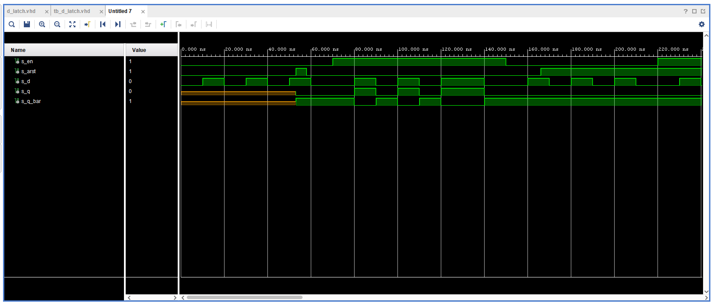
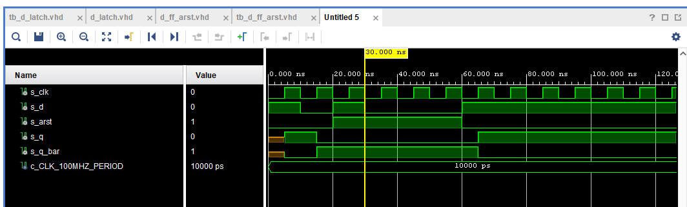
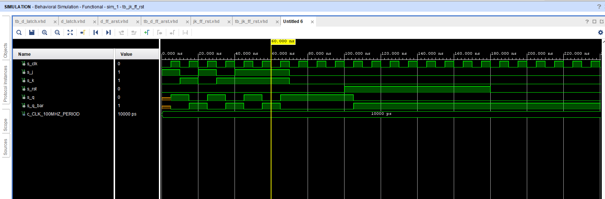
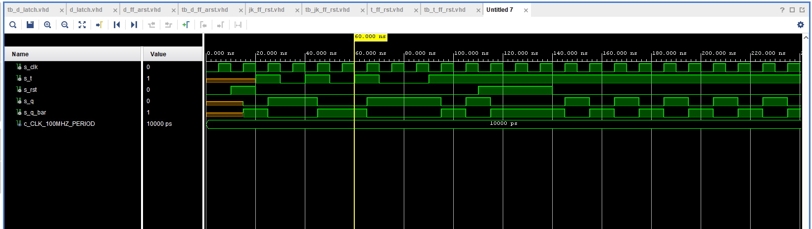

# Lab 7: Latches and Flip-flops
## Preparation tasks (done before the lab at home)

   | **D** | **Qn** | **Q(n+1)** | **Comments** |
   | :-: | :-: | :-: | :-- |
   | 0 | 0 | 0 | No change |
   | 0 | 1 | 0 | Change |
   | 1 | 1 | 1 | No change |
   | 1 | 0 | 1 | Change |

   | **J** | **K** | **Qn** | **Q(n+1)** | **Comments** |
   | :-: | :-: | :-: | :-: | :-- |
   | 0 | 0 | 0 | 0 | No change |
   | 0 | 0 | 1 | 1 | No change |
   | 0 | 1 | 0 | 0 | Reset |
   | 0 | 1 | 1 | 0 | Reset |
   | 1 | 0 | 0 | 1 | Set |
   | 1 | 0 | 1 | 1 | Set |
   | 1 | 1 | 0 | 1 | Toggle |
   | 1 | 1 | 1 | 0 | Toggle |

   | **T** | **Qn** | **Q(n+1)** | **Comments** |
   | :-: | :-: | :-: | :-- |
   | 0 | 0 | 0 | No change |
   | 0 | 1 | 1 | No change |
   | 1 | 0 | 1 | Toggle |
   | 1 | 1 | 0 | Toggle |
## 2) D latch
### Process
```vhdl
    p_d_latch : process(d, arst, en)
    begin
        if (arst = '1') then
            q     <= '0';
            q_bar <= '1';
        elsif (en = '1') then
            q    <= d;
        end if;
    end process p_d_latch;
```
### Reset
```vhdl
    p_reset_gen :process
    begin
        s_arst <= '0';
        wait for 50ns;
        
        s_arst <= '1';
        wait for 10ns;
        
        s_arst <= '0';
        wait for 108ns;
        
        s_arst <= '1';
        
        wait;
    end process p_reset_gen;
```
### stimulus
```vhdl
    p_stimulus : process
    begin
        report "Stimulus process started" severity note;
        s_en    <= '0';
        s_d     <= '0';
        assert (s_en = '0' and s_d = '0') report "Failed no. 1" severity note;
        
        wait for 10 ns;
        s_d    <= '1';
        wait for 10 ns;
        s_d    <= '0';
        wait for 10 ns;
        s_d    <= '1';
        wait for 10 ns;
        s_d    <= '0';
        wait for 10 ns;
        s_d    <= '1';
        wait for 10 ns;
        s_d    <= '0';
        wait for 10 ns;
        
        s_en <= '1';
        assert (s_en = '1') report "Failed no. 2" severity note;
        
        wait for 10 ns;
        s_d    <= '1';
        wait for 10 ns;
        s_d    <= '0';
        wait for 10 ns;
        s_d    <= '1';
        wait for 10 ns;
        s_d    <= '0';
        wait for 10 ns;
        s_d    <= '1';
        wait for 10 ns;
        s_d    <= '0';
        wait for 10 ns;
        
        s_en <= '0';
        assert (s_en = '0') report "Failed no. 3" severity note;
        
        wait for 10 ns;
        s_d    <= '1';
        wait for 10 ns;
        s_d    <= '0';
        wait for 10 ns;
        s_d    <= '1';
        wait for 10 ns;
        s_d    <= '0';
        wait for 10 ns;
        s_d    <= '1';
        wait for 10 ns;
        s_d    <= '0';
        wait for 10 ns;
        
        s_en <= '1';
        assert (s_en = '1') report "Failed no. 4" severity note;
        
        wait for 10 ns;
        s_d    <= '1';
        wait for 10 ns;
        s_d    <= '0';
        wait for 10 ns;
        s_d    <= '1';
        wait for 10 ns;
        s_d    <= '0';
        wait for 10 ns;
        s_d    <= '1';
        wait for 10 ns;
        s_d    <= '0';
        wait for 10 ns;
        
        report "Stimulus process finished" severity note;
        wait;
    end process p_stimulus;
```

## 3)d_ff_arst
```vhdl
library IEEE;
use IEEE.STD_LOGIC_1164.ALL;

-- Uncomment the following library declaration if using
-- arithmetic functions with Signed or Unsigned values
--use IEEE.NUMERIC_STD.ALL;

-- Uncomment the following library declaration if instantiating
-- any Xilinx leaf cells in this code.
--library UNISIM;
--use UNISIM.VComponents.all;

entity d_ff_arst is
     Port (
           clk   : in STD_LOGIC;
           arst  : in STD_LOGIC;
           d     : in STD_LOGIC;
           q     : out STD_LOGIC;
           q_bar : out STD_LOGIC);
end d_ff_arst;

architecture Behavioral of d_ff_arst is
begin
        p_d_ff_arst : process (clk, arst)
        begin
           if (arst = '1') then
               q <= '0';
               q_bar <= '1';
               
           elsif rising_edge(clk) then
               q <=d;
               q_bar <= not d;
               
           end if;
        end process p_d_ff_arst;


end Behavioral;
```
```vhdl
library IEEE;
use IEEE.STD_LOGIC_1164.ALL;


entity tb_d_ff_arst is
end tb_d_ff_arst;

architecture Behavioral of tb_d_ff_arst is
    constant c_CLK_100MHZ_PERIOD : time    := 10 ns;

    signal s_clk : STD_LOGIC;
    signal s_d : STD_LOGIC;
    signal s_arst : STD_LOGIC;
    signal s_q : STD_LOGIC;
    signal s_q_bar : STD_LOGIC;
begin

uut_d_ff_arst : entity work.d_ff_arst
    port map (
        clk     =>  s_clk,
        d       =>  s_d,
        arst    =>  s_arst,
        q       =>  s_q,
        q_bar   =>  s_q_bar
    );
    
    --------------------------------------------------------------------
    -- Clock generation process
    --------------------------------------------------------------------
    p_clk_gen : process
    begin
        while now < 750 ns loop         -- 75 periods of 100MHz clock
            s_clk <= '0';
            wait for c_CLK_100MHZ_PERIOD / 2;
            s_clk <= '1';
            wait for c_CLK_100MHZ_PERIOD / 2;
        end loop;
        wait;
    end process p_clk_gen;
    
    --------------------------------------------------------------------
    -- Reset generation process
    --------------------------------------------------------------------
    p_reset_gen : process
    begin
        s_arst <= '0';
        wait for 20 ns;
        s_arst <= '1';                 -- Reset activated
        wait for 40 ns;
        s_arst <= '0';
        wait;
    end process p_reset_gen;

    p_stimulus : process
    begin

        report "Stimulus process started. ---------------------------------------" severity note;

        s_d     <=  '1';

        wait for 10ns;

        assert (s_q = '0' and s_q_bar = '1') report "Failed 1" severity note;
        
        s_d     <=  '0';

        wait for 10ns;

        assert (s_q = '0' and s_q_bar = '1') report "Failed 2" severity note;
        
        s_d     <=  '1';

        wait for 10ns;

        assert (s_q = '1' and s_q_bar = '0') report "Failed 3" severity note;
       
        s_d     <=  '0';

        wait for 10ns;

        assert (s_q = '0' and s_q_bar = '1') report "Failed 4" severity note;
        
        wait for 20ns;

        s_d     <=  '1';

        wait for 10ns;

        assert (s_q = '0' and s_q_bar = '1') report "Failed 5" severity note;
        
        report "Stimulus process ended." severity note;
        wait;
    end process p_stimulus;        

end Behavioral;
```

## 3)jk_ff_rst
```vhdl
----------------------------------------------------------------------------------
-- Company: 
-- Engineer: 
-- 
-- Create Date: 03/24/2021 11:27:52 AM
-- Design Name: 
-- Module Name: tb_jk_ff_rst - Behavioral
-- Project Name: 
-- Target Devices: 
-- Tool Versions: 
-- Description: 
-- 
-- Dependencies: 
-- 
-- Revision:
-- Revision 0.01 - File Created
-- Additional Comments:
-- 
----------------------------------------------------------------------------------


library IEEE;
use IEEE.STD_LOGIC_1164.ALL;

-- Uncomment the following library declaration if using
-- arithmetic functions with Signed or Unsigned values
--use IEEE.NUMERIC_STD.ALL;

-- Uncomment the following library declaration if instantiating
-- any Xilinx leaf cells in this code.
--library UNISIM;
--use UNISIM.VComponents.all;

entity tb_jk_ff_rst is
end tb_jk_ff_rst;

architecture Behavioral of tb_jk_ff_rst is
    constant c_CLK_100MHZ_PERIOD : time    := 10 ns;
   
    signal s_clk : STD_LOGIC;
    signal s_j : STD_LOGIC;
    signal s_k : STD_LOGIC;
    signal s_rst : STD_LOGIC;
    signal s_q : STD_LOGIC;
    signal s_q_bar : STD_LOGIC;
begin

uut_d_ff_arst : entity work.jk_ff_rst
    port map (
        clk     =>  s_clk,
        j       =>  s_j,
        k       =>  s_k,
        rst     =>  s_rst,
        q       =>  s_q,
        q_bar   =>  s_q_bar
    );
    
    --------------------------------------------------------------------
    -- Clock generation process
    --------------------------------------------------------------------
    p_clk_gen : process
    begin
        while now < 750 ns loop         -- 75 periods of 100MHz clock
            s_clk   <= '0';
            wait for c_CLK_100MHZ_PERIOD / 2;
            s_clk   <= '1';
            wait for c_CLK_100MHZ_PERIOD / 2;
        end loop;
        wait;
    end process p_clk_gen;
    
    --------------------------------------------------------------------
    -- Reset generation process
    --------------------------------------------------------------------
    p_reset_gen : process
    begin
        s_rst   <= '0';
        wait for 100 ns;
        s_rst   <= '1';                 -- Reset activated
        wait for 80 ns;
        s_rst   <= '0';
        wait;
    end process p_reset_gen;

    p_stimulus : process
    begin
        
        report "Stimulus process started. ---------------------------------------" severity note;
        
        s_j <=  '1';
        s_k <=  '0'; 
        
        wait for 10ns;
        
        assert (s_q = '1' and s_q_bar = '0') report "Failed 1" severity note;
        
        
        s_j <=  '0';
        s_k <=  '1';
        
        wait for 10ns;
        
        assert (s_q = '0' and s_q_bar = '1') report "Failed 2" severity note;
                
        
        s_j <=  '1';
        s_k <=  '0';
        
        wait for 10ns;
        
        assert (s_q = '1' and s_q_bar = '0') report "Failed 3" severity note;
        
        
        s_j <=  '0';
        s_k <=  '1';    
        
        wait for 10ns;
        
        assert (s_q = '0' and s_q_bar = '1') report "Failed 4" severity note;
        
        
        s_j <=  '1';
        s_k <=  '1';
        
        wait for 10ns;
        
        assert (s_q = '1' and s_q_bar = '0') report "Failed 5" severity note;
        
        
        s_j <=  '1';
        s_k <=  '1';
        
        wait for 10ns;
        
        assert (s_q = '0' and s_q_bar = '1') report "Failed 6" severity note;
        
        
        s_j <=  '1';
        s_k <=  '1';
        
        wait for 10ns;        
        
        assert (s_q = '1' and s_q_bar = '0') report "Failed 7" severity note;
        
        
        s_j <=  '0';
        s_k <=  '0';
        
        wait for 10ns;
        
        assert (s_q = '1' and s_q_bar = '0') report "Failed 8" severity note;
        
        report "Stimulus process ended. ---------------------------------------" severity note;
        wait;
    end process p_stimulus;

end Behavioral;

```
```vhdl
----------------------------------------------------------------------------------
-- Company: 
-- Engineer: 
-- 
-- Create Date: 03/24/2021 11:13:50 AM
-- Design Name: 
-- Module Name: jk_ff_rst - Behavioral
-- Project Name: 
-- Target Devices: 
-- Tool Versions: 
-- Description: 
-- 
-- Dependencies: 
-- 
-- Revision:
-- Revision 0.01 - File Created
-- Additional Comments:
-- 
----------------------------------------------------------------------------------


library IEEE;
use IEEE.STD_LOGIC_1164.ALL;

-- Uncomment the following library declaration if using
-- arithmetic functions with Signed or Unsigned values
--use IEEE.NUMERIC_STD.ALL;

-- Uncomment the following library declaration if instantiating
-- any Xilinx leaf cells in this code.
--library UNISIM;
--use UNISIM.VComponents.all;

entity jk_ff_rst is
    Port ( clk : in STD_LOGIC;
           j : in STD_LOGIC;
           k : in STD_LOGIC;
           rst : in STD_LOGIC;
           q : out STD_LOGIC;
           q_bar : out STD_LOGIC);
end jk_ff_rst;

architecture Behavioral of jk_ff_rst is
    signal  s_q     :   STD_LOGIC;
    signal  s_q_bar :   STD_LOGIC;
begin
    
    jk_ff_rst : process(clk)
    begin
        if rising_edge(clk) then

            if (rst = '1') then

                s_q         <=  '0';
                s_q_bar     <=  '1'; 

             else

                if (j = '0' and k = '0') then -- no change

                    s_q     <=  s_q;
                    s_q_bar <=  s_q_bar;

                elsif (j = '0' and k = '1') then -- reset

                    s_q     <=  '0';
                    s_q_bar <=  '1';

                elsif (j = '1' and k = '0') then -- set

                    s_q     <=  '1';
                    s_q_bar <=  '0';

                else 

                    s_q     <=  not s_q;
                    s_q_bar <=  not s_q_bar;

                end if;
             end if;
        end if;

    end process jk_ff_rst;

    q       <=  s_q;
    q_bar   <=  s_q_bar;
end Behavioral;
```

## 3)t_ff_rst
```vhl
----------------------------------------------------------------------------------
-- Company: 
-- Engineer: 
-- 
-- Create Date: 03/25/2021 07:58:39 PM
-- Design Name: 
-- Module Name: tb_t_ff_rst - Behavioral
-- Project Name: 
-- Target Devices: 
-- Tool Versions: 
-- Description: 
-- 
-- Dependencies: 
-- 
-- Revision:
-- Revision 0.01 - File Created
-- Additional Comments:
-- 
----------------------------------------------------------------------------------


library IEEE;
use IEEE.STD_LOGIC_1164.ALL;

-- Uncomment the following library declaration if using
-- arithmetic functions with Signed or Unsigned values
--use IEEE.NUMERIC_STD.ALL;

-- Uncomment the following library declaration if instantiating
-- any Xilinx leaf cells in this code.
--library UNISIM;
--use UNISIM.VComponents.all;

entity tb_t_ff_rst is
--  Port ( );
end tb_t_ff_rst;

architecture Behavioral of tb_t_ff_rst is
    constant c_CLK_100MHZ_PERIOD : time    := 10 ns;
   
    signal s_clk : STD_LOGIC;
    signal s_t : STD_LOGIC;
    signal s_rst : STD_LOGIC;
    signal s_q : STD_LOGIC;
    signal s_q_bar : STD_LOGIC;
begin

    uut_d_ff_arst : entity work.t_ff_rst
    port map (
        clk     =>  s_clk,
        t       =>  s_t,
        rst     =>  s_rst,
        q       =>  s_q,
        q_bar   =>  s_q_bar
    );
    
    --------------------------------------------------------------------
    -- Clock generation process
    --------------------------------------------------------------------
    p_clk_gen : process
    begin
        while now < 750 ns loop         -- 75 periods of 100MHz clock
            s_clk   <= '0';
            wait for c_CLK_100MHZ_PERIOD / 2;
            s_clk   <= '1';
            wait for c_CLK_100MHZ_PERIOD / 2;
        end loop;
        wait;
    end process p_clk_gen;
    
    --------------------------------------------------------------------
    -- Reset generation process
    --------------------------------------------------------------------
    p_reset_gen : process
    begin
        s_rst   <= '0';
        wait for 10 ns;
        s_rst   <= '1';                 -- Reset activated
        wait for 10 ns;
        s_rst   <= '0';
        wait for 90 ns;
        s_rst   <= '1';
        wait for 30 ns;
        s_rst   <= '0';
        wait;
    end process p_reset_gen;

    
    p_stimulus : process
    begin

        report "Stimulus process started. " severity note;
        
        wait for 20 ns;

        s_t <=  '1';

        wait for 10ns;

        assert (s_q = '1' and s_q_bar = '0') report "Failed 1" severity note;
        
        s_t <=  '0';

        wait for 10ns;

        assert (s_q = '1' and s_q_bar = '0') report "Failed 2" severity note;

        s_t <=  '1';
        
        wait for 10ns;

        assert (s_q = '0' and s_q_bar = '1') report "Failed 3" 
        severity note;
        
        s_t <=  '0';
        
        wait for 10ns;
        
        assert (s_q = '0' and s_q_bar = '1') report "Failed 4" 
        severity note;
        
        s_t <=  '1';
        
        wait for 10ns;
        
        assert (s_q = '1' and s_q_bar = '0') report "Failed 5" severity note;
        
        s_t <=  '0';
        
        wait for 10ns;
        
        assert (s_q = '1' and s_q_bar = '0') report "Failed 6" severity note;
        
        s_t <=  '0';
        
        wait for 10ns;
        
        assert (s_q = '1' and s_q_bar = '0') report "Failed 6" severity note;
 
        s_t <=  '1';
        
        wait for 10ns;
        
        assert (s_q = '0' and s_q_bar = '1') report "Failed 6" severity note;
           
        report "Stimulus process ended. " severity note;
        wait;
    end process p_stimulus;


end Behavioral;

```
```vhdl
----------------------------------------------------------------------------------
-- Company: 
-- Engineer: 
-- 
-- Create Date: 03/25/2021 07:54:01 PM
-- Design Name: 
-- Module Name: t_ff_rst - Behavioral
-- Project Name: 
-- Target Devices: 
-- Tool Versions: 
-- Description: 
-- 
-- Dependencies: 
-- 
-- Revision:
-- Revision 0.01 - File Created
-- Additional Comments:
-- 
----------------------------------------------------------------------------------


library IEEE;
use IEEE.STD_LOGIC_1164.ALL;

-- Uncomment the following library declaration if using
-- arithmetic functions with Signed or Unsigned values
--use IEEE.NUMERIC_STD.ALL;

-- Uncomment the following library declaration if instantiating
-- any Xilinx leaf cells in this code.
--library UNISIM;
--use UNISIM.VComponents.all;

entity t_ff_rst is
    Port ( clk : in STD_LOGIC;
           t : in STD_LOGIC;
           rst : in STD_LOGIC;
           q : out STD_LOGIC;
           q_bar : out STD_LOGIC);
end t_ff_rst;

architecture Behavioral of t_ff_rst is
    signal  s_q     :   STD_LOGIC;
    signal  s_q_bar :   STD_LOGIC;
begin

    t_ff_rst : process(clk)
    begin

        if rising_edge(clk) then

            if (rst = '1') then

                s_q         <=  '0';
                s_q_bar     <=  '1'; 

             else

                if (t = '0') then

                    s_q     <=  s_q;
                    s_q_bar <=  s_q_bar;

                else

                    s_q     <=  not s_q;
                    s_q_bar <=  not s_q_bar;

                end if;
             end if;
        end if;
    end process t_ff_rst;


    q       <=  s_q;
    q_bar   <=  s_q_bar;
end Behavioral;

```

